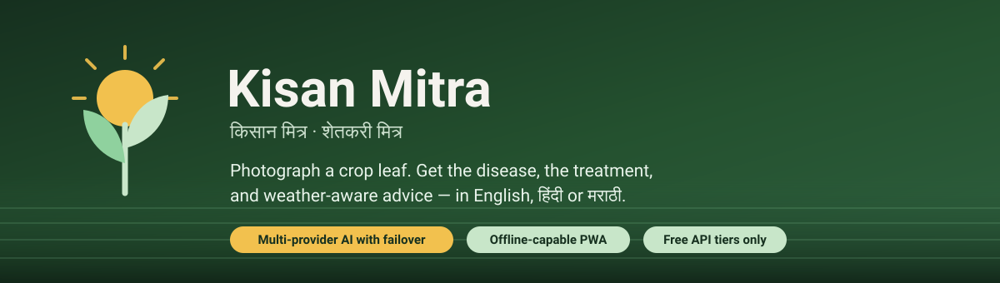
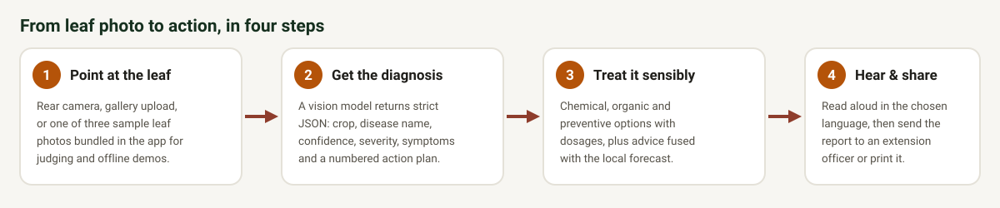
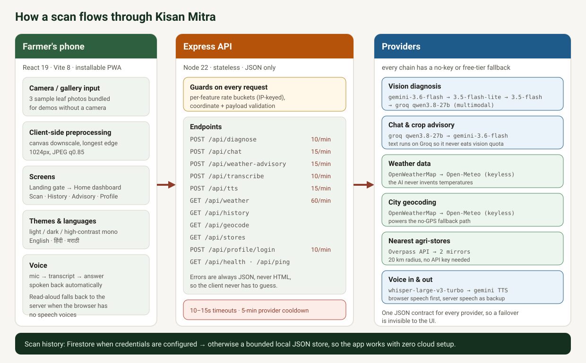

# Kisan Mitra

**AI crop health and advisory for Indian farmers.** Photograph a crop leaf, get a diagnosis, treatment options with dosages, and weather-aware advice — spoken aloud in English, हिंदी or मराठी.

[](LICENSE)
[](https://nodejs.org)
[](frontend/vite.config.js)
[](#testing)

---

## The problem

A farmer notices spots on a tomato leaf. They have three options: guess, ask a neighbour who is guessing too, or travel to an extension officer and wait days. Meanwhile the infection spreads, and the fungicide they eventually buy is often the wrong one or applied at the wrong dose.

Kisan Mitra shortens that loop to about a minute. One photo in, an actionable plan out — with the chemical and organic options, the exact dosage per litre, *and* whether the coming weather will wash the spray away before it works.

Built for the hackathon problem statements **AG-01** (smart crop disease detection) and **AG-02** (localized weather forecasts and crop recommendations).

## What it does

| Capability | How it works |
|---|---|
| **Leaf disease detection** | Camera, gallery, or a bundled sample photo → a multimodal model returns crop, disease, confidence, severity, symptoms, and a numbered action plan |
| **Trilingual output** | Every field the farmer reads exists in English, Hindi and Marathi (`*_hi`, `*_mr`) — generated in the same AI call, not a second translation pass |
| **Treatment that's specific** | Chemical, organic and preventive options with dosages, spray timing, and harvest waiting periods |
| **Weather-aware advisory** | Current conditions + 5-day forecast, then an AI answer that combines *this* diagnosis with *this* forecast, falling back to rule-based tips if AI is unavailable |
| **Read aloud** | Browser speech synthesis when the device has voices, and a Gemini TTS fallback (server-rendered WAV) when it doesn't — so "Read Aloud" can't silently fail |
| **Voice input** | Hold the mic, speak in Hindi/English/Marathi → Groq Whisper transcribes → the answer is spoken back automatically |
| **Farm sign-in** | Phone number is the identity (10 digits, no password). History follows the farmer across visits |
| **Scan history** | Firestore when configured, otherwise a bounded local JSON store — history works with zero cloud setup |
| **Nearby agri-stores** | OpenStreetMap Overpass lookup of agrochemical / farm / garden shops within 20 km, with distance |
| **Share the report** | WhatsApp share text or print/PDF of the full diagnosis |
| **Installable PWA** | Service-worker precache, manifest, standalone display, plus an offline banner when connectivity drops |
| **Outdoor-readable UI** | Token-based palette with documented contrast ratios, three themes (light / dark / high-contrast mono), 48px+ tap targets, solid button fills instead of hairline outlines |

<p align="center">
  
</p>

## Architecture

<p align="center">
  
</p>

Two processes: an Express API and a React/Vite PWA that proxies `/api/*` to it.

### Provider chains

Nothing in the app depends on a single API key. Every externally-backed feature has a fallback:

```
Vision diagnosis   gemini-3.6-flash → gemini-3.5-flash-lite → gemini-3.5-flash → groq qwen3.8-27b
Chat + advisory    groq qwen3.8-27b → gemini-3.6-flash
Weather data       OpenWeatherMap → Open-Meteo (keyless, unlimited)
City geocoding     OpenWeatherMap → Open-Meteo (keyless)
Nearby stores      overpass-api.de → overpass.kumi.systems → overpass.private.coffee
Speech in          groq whisper-large-v3-turbo
Speech out         Web Speech API → Gemini TTS (WAV)
Storage            Firestore → local JSON file (backend/data, gitignored)
```

Two decisions worth explaining:

**Text runs on Groq, vision runs on Gemini.** Chat and advisory are frequent and cheap, so they go to the fast free tier. Diagnosis is the expensive, accuracy-critical path, so it goes to the stronger vision model first. Keeping them on separate providers also means a busy chatbot can't exhaust the quota that diagnosis depends on.

**Weather data never comes from a language model.** An LLM would happily invent a temperature. Weather and geocoding talk to real weather APIs, with a keyless fallback so the feature survives an expired or rate-limited key. The AI is only used to *interpret* data that already exists.

### Why hosted multimodal models instead of a trained CNN

The conventional approach is to train a classifier (MobileNetV2 on PlantVillage) and host it. We deliberately didn't:

- A trained model only knows its training classes. Hosted multimodal models handle crops and diseases outside any fixed list, which matters in the field.
- No training pipeline, no GPU hosting, no model drift to maintain during a hackathon.
- Hindi and Marathi come back in the same call as the diagnosis, with no translation layer.
- Trade-off, stated plainly: the app needs network connectivity for diagnosis, and diagnosis quality depends on the provider. Client-side image compression mitigates the bandwidth half of that problem; the provider chain mitigates the other half.

### Making an LLM return usable JSON

Asking for strict JSON is not enough in practice. The diagnosis service prompts for a fixed schema and then repairs the shapes we actually observed: markdown fences around the object, a prematurely closed root object (which normally discards an otherwise-good diagnosis), treatment sub-fields drifting to the root, and array fields arriving as a single string. Confidence and severity are also surfaced rather than hidden — a result under 50% confidence shows a "consult a local expert" warning instead of pretending certainty.

## Sample input images

The app ships three leaf photos so the scan flow can be demonstrated without a camera, including from a laptop:

| Image | Used for |
|---|---|
| [`sample1.jpg`](frontend/public/samples/sample1.jpg) | Healthy leaf demo |
| [`sample2.jpg`](frontend/public/samples/sample2.jpg) | Early blight on tomato — the demo case |
| [`sample3.jpg`](frontend/public/samples/sample3.jpg) | Second healthy leaf demo |

Attribution and licences are recorded in [`frontend/public/samples/CREDITS.md`](frontend/public/samples/CREDITS.md).

## Tech stack

| Layer | Choice | Notes |
|---|---|---|
| Frontend | React 19 + Vite 8 | Fast dev loop, small bundle |
| PWA | `vite-plugin-pwa` | Service worker + manifest generated at build time |
| Icons | `lucide-react` | Inline SVG, no icon font request |
| Styling | CSS custom properties | One token set in `frontend/src/index.css`, consumed by every component |
| Lint | `oxlint` | Zero warnings on the current tree |
| Backend | Node.js 22+ / Express 5 | Stateless JSON API |
| Uploads | `multer` (memory storage) | 10 MB cap, MIME allow-list, minimum-size check |
| AI | `@google/genai` + Groq (OpenAI-compatible HTTP) | Vision, text, speech |
| Storage | `firebase-admin` | Optional; local JSON fallback when unset |
| Weather | OpenWeatherMap, Open-Meteo | Keyed primary, keyless backup |
| Places | Overpass API | No API key |

## Getting started

### One command

```bash
./install.sh            # checks Node, creates backend/.env, installs both packages
./install.sh --start    # ...then starts the API and the app together
./install.sh --check    # verify an existing setup without installing anything
```

Works on Linux, macOS and Windows (Git Bash or WSL); needs only bash and Node. The script checks your Node version, creates `backend/.env` from the template without overwriting an existing one, installs with `npm ci` when a lockfile is present, reports which API keys are still placeholders, runs the tests and the linter, and (with `--start`) waits until both servers actually answer before printing the URL.

Prefer doing it by hand? The three steps below are all it does.

### Prerequisites

- **Node.js 22 or newer** (`firebase-admin@14` requires it; Vite 8 needs ≥20.19)
- Free API keys: [Groq](https://console.groq.com) (text, vision fallback, Whisper), [Google AI Studio](https://aistudio.google.com/apikey) (vision, TTS)
- Optional: [OpenWeatherMap](https://openweathermap.org/api) (new keys can take up to a couple of hours to activate — weather still works without it via Open-Meteo)
- Optional: a Firebase project for cloud scan history

### 1. Backend

```bash
cd backend
cp .env.example .env     # then paste your keys into .env
npm install
npm run dev              # http://localhost:5000
```

On boot the server reports each key it found — never the values — so a bad setup is obvious immediately:

```
🌾 Kisan Mitra backend running on http://localhost:5000
   Environment: development
   Frontend URL: http://localhost:5173
   Trust Proxy: ⚠️ NOT SET — rate limits will apply per-proxy-IP in production
   Groq API Key: ✅ Set
   Gemini API Key: ✅ Set
   OpenWeather Key: ✅ Set
   Firebase Project: ⚠️ Placeholder — replace it in backend/.env

   Scan history → local JSON store (backend/data/scans.json)
   PROFILE_AUTH_SECRET: ❌ not set — sessions use a derived key.
   Set a long random value in backend/.env before deploying.
```

`.env.example` ships placeholder text (`your_groq_api_key_here`, `replace_with_a_long_random_secret`), and a value left at its placeholder is reported as **⚠️ Placeholder**, not **✅ Set** — the same distinction `/api/health` and `install.sh` make. A bare presence check would have called those keys configured while every request failed; instead the boot log, the health endpoint and the installer all agree on what is actually usable.

### 2. Frontend

```bash
cd frontend
npm install
npm run dev              # http://localhost:5173
```

Open <http://localhost:5173>, press **Enter to Scan**, and use one of the sample leaf photos if you don't have a crop handy.

> **Note on `PORT`:** `dotenv` never overwrites a variable that already exists in the environment. If your shell exports `PORT`, that value wins over `backend/.env`. Set it explicitly (`PORT=5000 npm run dev`) if the server starts on an unexpected port.

### Environment variables

Only the first two are required to see the app work; everything else degrades gracefully.

| Variable | Default | Purpose |
|---|---|---|
| `GROQ_API_KEY` | — | **Required.** Chat, advisory, Whisper transcription, vision fallback |
| `GEMINI_API_KEY` | — | **Required.** Primary vision diagnosis, TTS fallback |
| `GROQ_MODEL` | `qwen/qwen3.8-27b` | Text model for chat and advisory |
| `GROQ_VISION_MODEL` | `qwen/qwen3.8-27b` | Vision fallback model |
| `GROQ_TRANSCRIBE_MODEL` | `whisper-large-v3-turbo` | Speech-to-text model |
| `DIAGNOSIS_PROVIDER_ORDER` | `gemini,groq` | Order to try vision providers |
| `GEMINI_VISION_MODEL_1/2/3` | `gemini-3.6-flash`, `gemini-3.5-flash-lite`, `gemini-3.5-flash` | Vision models tried in order |
| `GEMINI_TTS_MODEL` | `gemini-2.5-flash-preview-tts` | Model behind `/api/tts` |
| `OPENWEATHER_API_KEY` | — | Preferred weather + geocoding provider |
| `FIREBASE_PROJECT_ID` | — | Enables Firestore history. A placeholder value is ignored and history uses the local JSON store instead |
| `FIREBASE_SERVICE_ACCOUNT_PATH` | `./firebase-service-account.json` | Falls back to application default credentials |
| `PROFILE_AUTH_SECRET` | derived | Signs profile session tokens. **Set this in production.** The `.env.example` placeholder is *ignored* rather than trusted — a repo-public signing key would let anyone forge a session |
| `PROVIDER_TIMEOUT_MS` | `10000` | Hard timeout per AI provider attempt |
| `PROVIDER_COOLDOWN_MS` | `300000` | How long a failing provider is skipped by the circuit breaker |
| `KISAN_DATA_DIR` | `backend/data` | Where the local JSON fallback store lives. Tests point this at a temp directory so they can never touch real data |
| `PORT` | `5000` | API port. Validated at boot: an empty, non-numeric or `0` value falls back to 5000 instead of binding a random port |
| `NODE_ENV` | `development` | Enables localhost CORS origins in development |
| `FRONTEND_URL` | `http://localhost:5173` | Allowed CORS origin |
| `TRUST_PROXY` | unset | Set to `1` behind Render/Railway/Cloudflare so rate limits key on the real client IP |

## API reference

All responses are JSON — including 404s, so client error handling never has to parse HTML. AI-costing routes are rate-limited per client IP, in per-feature buckets so one feature can't consume another's budget.

| Endpoint | Method | Limit | Description |
|---|---|---|---|
| `/api/health` | GET | — | Server status + which keys are configured |
| `/api/ping` | GET | — | Minimal latency check |
| `/api/diagnose` | POST | 10/min | `multipart/form-data`, field `image` → diagnosis JSON |
| `/api/weather` | GET | 60/min | `?lat=&lon=` → current conditions + 5-day forecast |
| `/api/weather-advisory` | POST | 15/min | Diagnosis + weather → combined AI advice |
| `/api/geocode` | GET | 30/min | `?q=<city>` → coordinates (geolocation fallback) |
| `/api/transcribe` | POST | 10/min | `multipart/form-data`, field `audio` → transcript |
| `/api/tts` | POST | 15/min | Text → `audio/wav` (server-side speech fallback) |
| `/api/chat` | POST | 15/min | Context-aware assistant reply |
| `/api/history` | GET | 60/min | Recent scans, scoped by `profileId` (authenticated) or `deviceId` |
| `/api/history` | POST | 30/min | Save a diagnosis |
| `/api/stores` | GET | 60/min | `?lat=&lon=` → agricultural shops within 20 km |
| `/api/profile/login` | POST | 10/min | Login-or-register by phone; `409` means "new phone, send a name" |
| `/api/profile` | GET | — | Hydrate a saved session from a bearer token |

### Example: `POST /api/diagnose`

A real response from `frontend/public/samples/sample2.jpg` (trimmed):

```json
{
  "success": true,
  "diagnosis": {
    "disease_name": "Early Blight of Tomato",
    "disease_name_hi": "टमाटर का अगेती झुलसा",
    "disease_name_mr": "टोमॅटोवरील अगेती झुलसा",
    "confidence": 0.92,
    "severity": "moderate",
    "description": "The tomato leaf shows characteristic dark brown to black concentric rings (target-board pattern)...",
    "description_hi": "...",
    "description_mr": "...",
    "symptoms": ["dark spots on leaves", "white mold"],
    "next_steps": ["..."],
    "next_steps_hi": ["..."],
    "next_steps_mr": ["..."],
    "treatment": {
      "chemical": "Apply Mancozeb 75% WP @ 2.5g/L ...",
      "chemical_hi": "...",
      "chemical_mr": "...",
      "organic": "Neem oil spray @ 5ml/L ...",
      "organic_hi": "...",
      "organic_mr": "...",
      "preventive": "Ensure proper spacing ...",
      "preventive_hi": "...",
      "preventive_mr": "..."
    },
    "extra_tips": ["..."],
    "extra_tips_hi": ["..."],
    "extra_tips_mr": ["..."],
    "crop_type": "Tomato",
    "yield_risk": "25-40% yield loss if left untreated",
    "yield_risk_hi": "...",
    "yield_risk_mr": "..."
  }
}
```

A non-plant photo returns `disease_name: "Invalid Image"` rather than an error, so the UI can explain the problem instead of showing a failure.

## Reliability notes

These exist because the alternative was a demo that broke on stage.

- **Circuit breaker.** A provider that times out or returns 429/5xx is skipped for `PROVIDER_COOLDOWN_MS` (5 minutes) instead of making every scan pay the timeout again. It rejoins the chain automatically.
- **Hard timeouts.** Vision attempts are bounded at 10s, text at 15s. Worst-case latency is bounded rather than open-ended.
- **Per-feature rate limiting.** In-memory, IP-keyed, fixed-window buckets per route. Restarting resets them, and it is per-instance — fine for a single-node demo, needs a shared store (Redis) for a real deployment.
- **Graceful degradation everywhere.** AI advisory failure still shows weather and rule-based tips. Whisper being down still allows typing. No speech voices still allows server TTS.
- **Input guards before spending money.** Minimum image size (1 KB) and audio size (2 KB), MIME allow-lists, 10 MB caps, and coordinate validation so an untrusted query param can never reach an upstream query builder.
- **Stale-response guards.** A superseded diagnosis request can't overwrite fresh state, and history verification happens server-side when a profile is claimed.

## Security

What is in place, and what still is not.

**Input validation**

- Uploads are checked by **magic bytes**, not by the client's declared MIME type. A text file sent as `image/png` is rejected with a clear message, and providers only ever receive a signature-verified image type. Size floors and ceilings (1 KB–10 MB images, 2 KB–10 MB audio) reject junk before any paid API call.
- Coordinates are range-validated on every geo route, so nothing untrusted reaches an upstream query builder; history writes require `disease_name` and `crop_type` to be strings and truncate untrusted identifiers.
- Chat and advisory payloads are filtered to known roles and bounded (20 turns, 2,000 characters each); text-to-speech is capped at 4,000 characters.

**Request abuse**

- Per-feature, per-IP fixed-window rate limits on every route that costs money or fans out upstream — including `/api/geocode` (30/min) and `/api/history` (60/min read, 30/min write), which were previously unrated. Exceeding a limit returns `429` with a `Retry-After` header.
- JSON bodies are capped at 1 MB (multipart uploads separately); oversized or malformed bodies return `413`/`400`, not a 500.
- Baseline security headers on every response: `X-Content-Type-Options: nosniff`, `X-Frame-Options: DENY`, `Referrer-Policy: no-referrer`, `Cross-Origin-Resource-Policy: same-site`.

**Sessions and secrets**

- Profile tokens are HMAC-SHA256 over a payload with a 30-day expiry, compared with `crypto.timingSafeEqual`; a token authorises only its own profile, and history requests claiming someone else's `profileId` get `403`.
- A known phone number cannot be taken over from a new device — the second device gets `401` rather than a session.
- A key left at its `.env.example` placeholder counts as **unconfigured**, in the boot log, `/api/health` and the installer alike. Without that, copying the template made every service report itself ready while nothing worked.
- `PROFILE_AUTH_SECRET` is held to the same rule: the template's `replace_with_a_long_random_secret` is *rejected* rather than used, because a signing key published in this repository would let anyone mint a token for any profile. An unusable secret falls back to a locally derived one, with a warning on every boot.
- API keys are read server-side only and never logged or returned; the health endpoint reports whether a key is configured, never its value. Error responses expose internal detail only when `NODE_ENV=development`.

**Still open, deliberately**

- **No OTP.** A phone number is an unverified identity — anyone who knows a number can attempt to register it. Acceptable for a hackathon prototype, not for real users.
- **Rate-limit state is in memory**, so it resets on restart and is not shared across instances. A real deployment needs a shared store.
- **The token and profile live in `localStorage`**, which any XSS on the origin could read. The app renders no user-supplied HTML and has no `dangerouslySetInnerHTML`, but an httpOnly cookie would be the stronger model.
- **Device-scoped history is keyed on a client-generated UUID** with no server-side proof of ownership. It is unguessable in practice, but it is not authentication.

## Privacy and data handling

- **No passwords.** Identity is a 10-digit phone number; the name is a display label. Tokens are HMAC-signed with a 30-day expiry and verified with a timing-safe comparison.
- **History is scoped, not public.** Requests scoped to a `profileId` require a valid token for that profile; otherwise history falls back to an anonymous per-device ID. Farmers don't see each other's scans.
- **Guest mode is complete.** Everything works without signing in; only cross-device history needs a profile.
- **Keys stay server-side.** The browser never sees an AI or weather API key.

## Design system

All colours are CSS custom properties defined once in `frontend/src/index.css` and consumed by components — no hex literals remain in any component stylesheet (the only literal colours are inside the inline SVG brand artwork). Contrast ratios are documented next to the tokens, and the system has three themes: light, dark, and a high-contrast monochrome mode for glare.

Text-on-CTA is a token (`--color-text-on-cta`) rather than hardcoded white, which is what keeps the dark theme readable: the amber brightens to `#E8A33D` there, so the label switches to dark ink for an 8.5:1 ratio (white would have been about 2:1).

| Token | Light value | Role |
|---|---|---|
| `--color-primary` | `#2E5F3E` | Brand green: header, primary actions |
| `--color-accent-cta` | `#B45309` | Harvest amber, reserved for the primary CTA |
| `--color-bg` | `#F7F6F2` | Warm paper background (less glare than pure white) |
| `--color-surface` | `#FFFFFF` | Cards and panels |
| `--color-text` | `#1F1E1A` | Body text |
| `--color-status-healthy` / `-moderate` / `-severe` | `#4A8B5C` / `#C48A2B` / `#B4432F` | Severity and confidence — deliberately distinct from brand green |

Three rules the interface follows:

1. **Status never reuses the brand colour**, so "the app is green" can't be mistaken for "the crop is healthy".
2. **One accent, few buttons.** The amber CTA only appears on the primary action of a screen, so the eye lands there first.
3. **Built for sunlight and cheap phones.** Solid button fills rather than thin outlines, medium-plus font weights, ≥48px tap targets, `Hind` typeface with Devanagari coverage, and images compressed before upload.

The PWA theme colour is kept in sync at `#2E5F3E` across `frontend/index.html` and the Vite manifest.

## Testing

```bash
./install.sh --check        # Node version, deps, tests, lint — installs nothing
cd backend && npm test      # node --test
cd frontend && npm run lint # oxlint
cd frontend && npm run build
```

`backend/test/profileStore.test.js` covers the security-relevant paths: a token authorises only the profile that created it, tampered/forged tokens are rejected, malformed tokens never authenticate, and re-registering an existing phone from a new device session fails with `AUTH_REQUIRED`.

The suite points `KISAN_DATA_DIR` at a throwaway temp directory **before** the store is loaded, so tests can never read, overwrite or delete real data — and it ends with a regression guard asserting the real store file is byte-identical afterwards. (An earlier version of this test wrote to the real store and then deleted it, which meant running `npm test` wiped every farmer profile.)

Scope, stated honestly: there is **one unit-test module and no browser/E2E suite**. The health, diagnose, weather, geocode, chat, history and transcribe routes were verified with an explicit 22-case error-path sweep plus live calls against real providers, but they are not covered by automated tests in the repository yet. Adding route-level tests with mocked providers is the next testing job.

## Limitations

We would rather judges know these than discover them:

- **Diagnosis needs connectivity** and depends on provider availability. It is an inference-over-API design, not an on-device model — offline scanning is not possible.
- **No accuracy benchmark.** We have not measured performance against a labelled dataset like PlantVillage, so we make no accuracy claim. Treat output as decision support, and the UI says so directly when confidence is low.
- **Phone identity is unverified.** There is no OTP, so a number is a label rather than proof; see the Security section for the other open items.
- **Storage is demo-tier.** The local fallback is a bounded JSON file (500 scans / 500 profiles), and `PROFILE_AUTH_SECRET` should be set explicitly in production.
- **One device per phone.** A phone number can hold only one active session; there is no password recovery or OTP verification yet.
- **In-memory rate limiting** resets on restart and is not shared between instances.
- **Provenance gap:** the licences for `sample1.jpg` and `sample3.jpg` were not recorded when they were added, unlike `sample2.jpg`. We would replace them with clearly-licensed images before any public distribution.

## Roadmap

1. Route-level backend tests with mocked providers, plus a browser smoke test for the scan flow.
2. OTP verification for phone sign-in, so a typo can't lock an account to one device.
3. Offline queue: save a scan locally when offline and submit it when connectivity returns, so the offline banner's promise is actually true.
4. Move rate limiting to a shared store, and have `/api/health` probe the AI providers instead of only reporting key presence.
5. Anonymised diagnosis telemetry to measure which crops and diseases are actually being scanned.

## Hackathon coverage

**AG-01 — Smart crop disease detection using image processing and ML**

Client-side image processing (canvas downscale + JPEG re-encode, so phones on rural bandwidth upload 5–10× less) → multimodal classification with a four-step provider chain → structured output (disease, confidence, severity, symptoms, treatment, yield risk) → delivered in three languages with voice output, sharing and export.

**AG-02 — Localized weather forecasts and crop recommendations**

Geolocation with a city-name fallback when permission is denied → OpenWeatherMap with a keyless Open-Meteo backup → current conditions and a 5-day forecast → an advisory prompt that fuses the specific diagnosis with the specific forecast, falling back to rule-based agronomic tips when the AI is unavailable.

### Demo script (about three minutes)

1. Open the app, switch language to हिंदी, and press **Enter to Scan** — the landing gate is part of the product, not a splash screen.
2. Home shows weather for the current location. Deny location permission on purpose, then search a city by name to show the fallback.
3. Go to **Scan**, pick `sample2.jpg` (early blight), and analyse. Point out confidence, severity, the numbered action plan, and the chemical/organic/preventive options with dosages.
4. Scroll to the weather advisory: this is the diagnosis and the forecast combined.
5. Press **Read Aloud**, then open the assistant and ask a follow-up by voice.
6. Toggle dark mode and the monochrome theme, then show the same report shared via WhatsApp or printed to PDF.

## Repository layout

```
KISAN-MITRA/
├── install.sh                       # one-command setup + --start / --check
├── backend/
│   ├── server.js                    # Express entry point, CORS, JSON 404, error handler
│   ├── middleware/
│   │   ├── rateLimit.js             # Per-feature in-memory rate limiter, no dependencies
│   │   └── profileAuth.js           # Bearer-token profile guard
│   ├── routes/
│   │   ├── health.js                # GET  /api/health, /api/ping
│   │   ├── diagnose.js              # POST /api/diagnose (upload → vision chain)
│   │   ├── weather.js               # GET  /api/weather
│   │   ├── weatherAdvisory.js       # POST /api/weather-advisory
│   │   ├── geocode.js               # GET  /api/geocode
│   │   ├── history.js               # GET/POST /api/history (profile- or device-scoped)
│   │   ├── stores.js                # GET  /api/stores (Overpass + mirror failover)
│   │   ├── chat.js                  # POST /api/chat
│   │   ├── transcribe.js            # POST /api/transcribe (Groq Whisper)
│   │   ├── tts.js                   # POST /api/tts (Gemini TTS → WAV)
│   │   └── profile.js               # POST /api/profile/login, GET /api/profile
│   ├── services/
│   │   ├── gemini.js                # Vision chain + JSON repair + circuit breaker
│   │   ├── textProvider.js          # Groq → Gemini text chain with timeout
│   │   ├── weatherService.js        # Weather + geocoding failover, response normalisation
│   │   ├── scanStore.js             # Firestore → local JSON scan persistence
│   │   ├── firebase.js              # Optional firebase-admin initialisation
│   │   └── profileStore.js          # Phone identity, HMAC session tokens
│   ├── test/profileStore.test.js    # Token + phone-identity tests (temp data dir)
│   └── .env.example
├── frontend/
│   ├── src/
│   │   ├── App.jsx                  # Shell: routing, language, themes, landing gate
│   │   ├── api.js                   # Typed-ish API client, timeouts, device ID
│   │   ├── index.css                # Design tokens + light/dark/mono themes
│   │   └── components/
│   │       ├── LandingPage.jsx      # Welcome gate with trilingual copy
│   │       ├── Home.jsx             # Dashboard: weather card, quick actions, recent scans
│   │       ├── CameraCapture.jsx    # Camera/gallery/samples + client-side compression
│   │       ├── DiagnosisResult.jsx  # Result card, treatment, share/print
│   │       ├── WeatherAdvisory.jsx  # Forecast + AI advisory + city fallback
│   │       ├── AgriStoreLocator.jsx # Nearby store lookup
│   │       ├── ScanHistory.jsx      # Scoped history with relative timestamps
│   │       ├── Chatbot.jsx          # Assistant with voice input and spoken replies
│   │       ├── VoiceButton.jsx      # Read-aloud with server TTS fallback
│   │       ├── ProfileModal.jsx     # Phone sign-in
│   │       ├── ConfirmDialog.jsx    # Sign-out confirmation
│   │       ├── OfflineBanner.jsx    # Connectivity state
│   │       └── Toast.jsx            # Notification host
│   ├── public/samples/              # Demo leaf photos (+ CREDITS.md)
│   └── vite.config.js               # React + PWA plugins, /api dev proxy
├── docs/                            # README diagrams (SVG)
└── LICENSE
```

## Contributors

| Name | Role | GitHub |
|---|---|---|
| **Raj Kapse** | Backend & API Development | [@raj-kapse](https://github.com/raj-kapse) |
| **Siyal Kambale** | Frontend & PWA | [@Siyalkamble](https://github.com/Siyalkamble) |
| **Naveen Thakur** | Full-Stack Lead | [@nav548777](https://github.com/nav548777) |

## Credits

- Field backdrop: ["Wheat field in Phagwara Punjab India"](https://commons.wikimedia.org/wiki/File:Wheat_field_in_Phagwara_Punjab_India.jpg) by Sixtybolts, CC BY-SA 2.0 — see [`frontend/public/CREDITS.md`](frontend/public/CREDITS.md).
- `sample2.jpg`: "Alternaria solani – leaf lesions" by Clemson University / USDA Cooperative Extension Slide Series, via Wikimedia Commons, CC BY 3.0 US — see [`frontend/public/samples/CREDITS.md`](frontend/public/samples/CREDITS.md).

## License

MIT — see [LICENSE](LICENSE).
